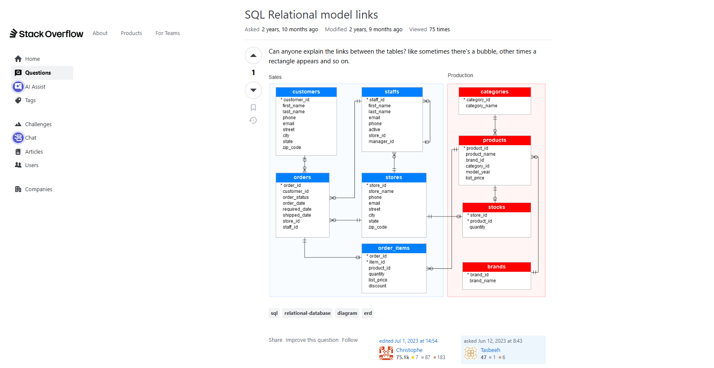

# PROYECTO `d1-example`
## Sistema de cadena de pizzerias ComePizza!🍕

### 0️⃣. Analisis del Proyecto
Se encontro un modelo en stack overflow [SQL Relational model links](https://stackoverflow.com/questions/76454919/sql-relational-model-links). donde se usara como modelo para plantear nuestro modelo de negocio.

El sistema de ventas es una api restfull tendra 5 categorias principales:
1. *Ventas (Orders & Order Items)*
    * `POST /orders`: Crear un nuevo pedido (aquí es donde recibes el `customer_id` y el array de productos para `order_items`).
    * `GET /orders`: Listar todos los pedidos (con filtros por fecha o estado).
    * `GET /orders/{id}`: Ver el detalle de un pedido específico (incluyendo sus productos).
    * `PATCH /orders/{id}/status`: Actualizar solo el estado del pedido (ej. de 'pendiente' a 'enviado').
2. *Catálogo de Productos (Production)*
    * `GET /products`: Listar productos. Puedes añadir filtros por `category_id` o `brand_id`.
    * `GET /products/{id}`: Detalle técnico de un producto.
    * `GET /categories`: Listar las categorías para llenar menús desplegables en el frontend.
    * `GET /brands`: Listar las marcas disponibles.
3. *Gestión de Inventario (Stocks & Stores)*
    * `GET /stores/{id}/stocks`: Ver qué productos y qué cantidades hay en una tienda específica.
    * `PUT /stocks/update`: Ajustar el stock manualmente (útil para inventarios físicos).
    * `GET /stores`: Listado de sucursales para que el cliente elija dónde comprar o recoger.
4. *Clientes (Customers)*
    * `GET /customers?email={email}`: Buscar un cliente para verificar si ya existe.
    * `POST /customers`: Registrar un nuevo cliente.
    * `GET /customers/{id}/orders`: Historial de compras de un cliente específico.
5. *Administración y Staff (Internal)*
    * `GET /staffs`: Listar empleados (usualmente protegido por roles de Admin).
    * `GET /staffs/{id}/performance`: Un endpoint analítico para ver cuántas órdenes ha procesado un empleado.

Tener en cuenta que <mark>{ orden de creacion de tablas afecta }</mark> lo cual tenemos que definir inicialmente como de crearan las migraciones y la factoria de datos. empezamos por crear `tablas independientes` luego `dependencias simples` al final `con dependencias cruzadas` si alguna vez hay dependencia circular es mejor que FK sea nullable se podria leer mas sobre eso aun que es mala practica
orden de creacion de tablas:                                 
1. categories, customers, products, stores
2. staff(depende stores), inventory(depende de stores y product)
3. orders y order_items

A primer plantemiento es tener las funciones basicas en funcionamiento lo cual se decide empezar con una semilla de `50 tiendas` , `5 categorias` , `50 productos`




### 0️⃣. Creación del proyecto
```bash
cd Laravel_repo
laravel new d1-example
cd d1-example
php artisan install:api
code .
```
```ini
DB_CONNECTION=pgsql
DB_HOST=127.0.0.1
DB_PORT=5432
DB_DATABASE=d1_example
DB_USERNAME=postgres
DB_PASSWORD=root
```

### 1️⃣. Categorias y productos, Customers y Stores
```bash
php artisan make:model Category -mc --api
php artisan migrate
php artisan migrate:refresh

php artisan make:model Product -mc --api

# para configurar faker en `config/app.php` en `'faker_locale' => 'es_ES',` o en un factory especifico `$fake = fake('es_ES');`  

php artisan make:model Customer -mfsc --api
php artisan migrate
php artisan db:seed

php artisan make:model Store -mfsc --api
php artisan migrate:refresh --seed
```
### 2️⃣. Inventory y Staff
```bash
php artisan make:model Inventory -mfsc --api
php artisan migrate:refresh --seed

php artisan make:model Staff -mfsc --api
```


